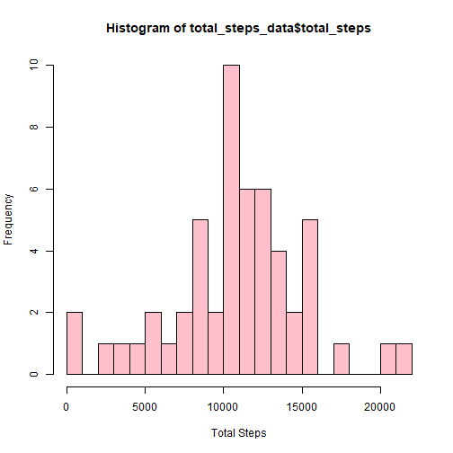
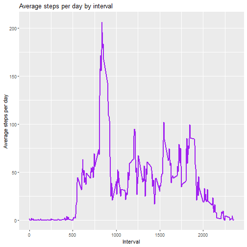
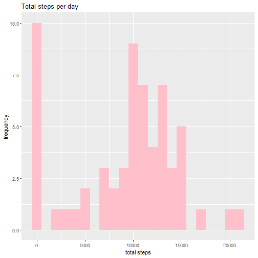
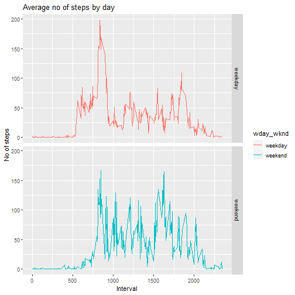

Author:-Prashant Chand
---
Title: "Reproducible Research: Peer Assessment 1"
---

## Introduction

It is now possible to collect a large amount of data about personal movement using activity monitoring devices such as a Fitbit, Nike Fuelband, or Jawbone Up. These type of devices are part of the “quantified self” movement – a group of enthusiasts who take measurements about themselves regularly to improve their health, to find patterns in their behavior, or because they are tech geeks. But these data remain under-utilized both because the raw data are hard to obtain and there is a lack of statistical methods and software for processing and interpreting the data.

This assignment makes use of data from a personal activity monitoring device. This device collects data at 5 minute intervals through out the day. The data consists of two months of data from an anonymous individual collected during the months of October and November, 2012 and include the number of steps taken in 5 minute intervals each day.

The variables included in this dataset are:

1) steps:Number of steps taking in a 5-minute interval (missing values are coded as NA)  
2) date: The date on which the measurement was taken in YYYY-MM-DD format  
3) interval: Identifier for the 5-minute interval in which measurement was taken  
The dataset is stored in a comma-separated-value (CSV) file and there are a total of 17,568 observations in this dataset.

## Loading and preprocessing the data
Code for downloading the file

```r
filename<-"activity.zip"
path<-getwd()
if(!file.exists(filename)){
  url<-"https://d396qusza40orc.cloudfront.net/repdata%2Fdata%2Factivity.zip"
  download.file(url,destfile = file.path(path,filename))
}
if(!file.exists("activity.csv")){
  unzip(filename)
}
```

Loading required package

```r
library(dplyr)
library(ggplot2)
```

Code for reading the file

```r
activitydata<-read.csv("activity.csv")
```

## What is mean total number of steps taken per day?
Grouping the data by date so that we can find total no of steps

```r
total_steps_data<-activitydata %>%group_by(date)%>%summarise(total_steps=sum(steps))
```

Histogram of the total number of steps taken each day

```r
hist(total_steps_data$total_steps,xlab = "Total Steps",col = "pink",breaks = 20)
```



Mean and median number of steps taken each day

```r
total_steps_data %>%summarise(mean=mean(total_steps,na.rm = TRUE),median=median(total_steps,na.rm = TRUE))
```

```
## # A tibble: 1 x 2
##     mean median
##    <dbl>  <int>
## 1 10766.  10765
```

## What is the average daily activity pattern?
Time series plot of the average number of steps taken

```r
average_steps_data<-activitydata[!is.na(activitydata$steps),] %>% group_by(interval) %>% summarise(average_steps=mean(steps))
ggplot(average_steps_data,aes(y=average_steps,x=interval))+geom_line(color="purple",size=1)+labs(x="Interval",y="Average steps per day",title = "Average steps per day by interval")
```



Which 5-minute interval, on average across all the days in the dataset, contains the maximum number of steps?

```r
average_steps_data[which.max(average_steps_data$average_steps),]$interval
```

```
## [1] 835
```

Calculate and report the total number of missing values in the dataset (i.e. the total number of rows with NAs)

```r
nrow(activitydata[is.na(activitydata$steps),])
```

```
## [1] 2304
```

## Imputing missing values
Code to describe and show a strategy for imputing missing data
Imputing NAs using the medain of the dataset

```r
activitydata[is.na(activitydata$steps), ]$steps<-median(activitydata$steps,na.rm = TRUE)
```

Writing new csv file 

```r
write.csv(activitydata,file = "newdata.csv")
```

Histogram of the total number of steps taken each day after missing values are imputed

```r
new_total_steps<-activitydata %>% group_by(date) %>% summarise(total_steps=sum(steps))
ggplot(new_total_steps,aes(total_steps))+geom_histogram(fill = "pink", binwidth = 1000)+labs(x="total steps",y="frequency",title = "Total steps per day")
```



Do these values differ from the estimates from the first part of the assignment  
New mean

```r
mean(new_total_steps$total_steps)
```

```
## [1] 9354.23
```
New median

```r
median(new_total_steps$total_steps)
```

```
## [1] 10395
```

## Are there differences in activity patterns between weekdays and weekends?
Create a new factor variable in the dataset with two levels – “weekday” and “weekend” indicating whether a given date is a weekday or weekend day.

```r
activitydata<-mutate(activitydata,day=weekdays(as.Date(activitydata$date)))
activitydata$wday_wknd<-c("weekday","weekend")
activitydata[grep("Monday|Tuesday|Wednesday|thursday|Friday",activitydata$day),]$wday_wknd<-"weekday"
activitydata[grep("saturday|Sunday",activitydata$day),]$wday_wknd<-"weekend"
activitydata$wday_wknd<-as.factor(activitydata$wday_wknd)
```

Make a panel plot containing a time series plot (i.e.type="l") of the 5-minute interval (x-axis) and the average number of steps taken, averaged across all weekday days or weekend days (y-axis)

```r
new_average_data<-activitydata %>% group_by(interval,wday_wknd) %>% summarise(average_steps=mean(steps))
ggplot(new_average_data,aes(interval,average_steps,color=wday_wknd))+geom_line()+facet_grid(wday_wknd~.)+labs(x="Interval",y="No of steps",title = "Average no of steps by day")
```


